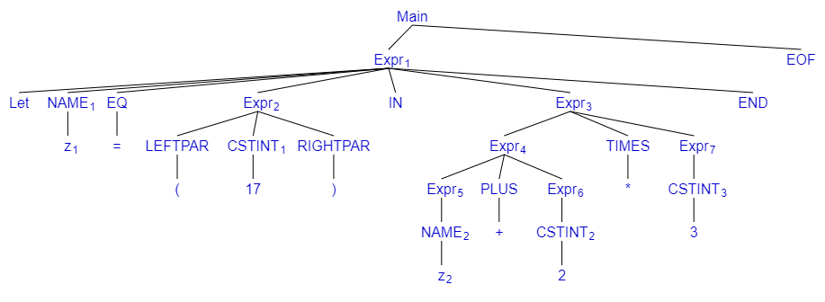

## Exercise 3.3
As per how it is done in the Slides for this table we skip over the steps of including the TOKENs NAME, CSTINT, TIMES, PLUS, these steps will be included in the tree in exercise 3.4.

let z = (17) in z + 2 * 3 end EOF
| Rule | Step  |
|---|---|
|   | Main |
| A | Expr EOF|
| F | Let z = Expr IN Expr END |
| G | Let z = Expr IN Expr * Expr END |
| C | Let z = Expr IN Expr * 3 END |
| H | Let z = Expr IN Expr + Expr * 3 END |
| C | Let z = Expr IN Expr + 2 * 3 END |
| B | Let z = Expr IN z + 2 * 3 END |
| E | Let z = ( Expr ) IN z + 2 * 3 END |
| C | Let z = ( 17 ) IN z + 2 * 3 END |

## Exercise 3.4


## Exercise 3.5
Commands + outputs found below
```bash
fromString "1+2* 3";;
val it: Absyn.expr = Prim ("+", CstI 1, Prim ("*", CstI 2, CstI 3))
```
```bash
fromString "1-2- 3";;
val it: Absyn.expr = Prim ("-", CstI 1, Prim ("-", CstI 2, CstI 3))
```
```bash
fromString "1 + -2";;
val it: Absyn.expr = Prim ("+", CstI 1, CstI -2)
```
```bash
fromString "x++";;
System.Exception: parse error near line 1, column 3
```
```bash
fromString "1 + 1.2";;
System.Exception: Lexer error: illegal symbol near line 1, column 6
```
```bash
fromString "1 + ";;
System.Exception: parse error near line 1, column 4
```
```bash
fromString "let z = (17) in z +23 end";;
val it: Absyn.expr =
Let ("z", CstI 17, Prim ("+", Var "z", Prim ("", CstI 2, CstI 3)))
```
```bash
fromString "let z = 17) inz+2*3 end";;
System.Exception: parse error near line 1, column 11
```
```bash
fromString "let in = (17) inz+2*3 end";;
System.Exception: parse error near line 1, column 6
```
```bash
fromString "1 + let x=5 in let y=7+x in y+y end + x end";;
val it: Absyn.expr =
Prim("+", CstI 1, Let ("x",CstI 5, Prim ("+", Let ("y", Prim ("+", CstI 7, Var "x"), Prim ("+" Var "y", Var "y")), Var "x")))
```

## Exercise 3.6
Answer to this can be found in our in the file located at "ex2_4Handout/Expr/Parse.fs" in the bottom of the file (it is noted with a comment above the function as well).

## Exercise 3.7
Answers to this can be found in the following files all located in the ex2_4Handout/Expr/ folder: Absyn.fs, ExprLex.fsl and ExprPar.fsy. In all 3 files a comment with (*3.7*) will be located right above the modifications we have made.
