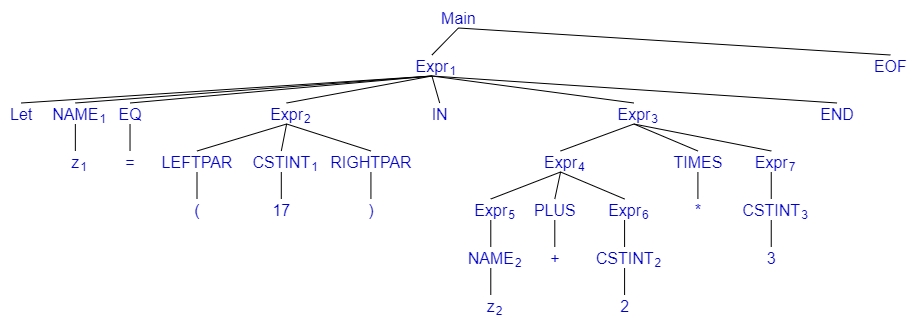

## Exercise 3.3
As per how it is done in the Slides for this table we skip over the steps of including the TOKENs NAME, CSTINT, TIMES, PLUS, these steps will be included in the tree in exercise 3.4.

let z = (17) in z + 2 * 3 end EOF
| Rule | Step  |
|---|---|
|   | Main |
| A | Expr EOF|
| F | Let z = Expr IN Expr END |
| G | Let z = Expr IN Expr * Expr END |
| C | Let z = Expr IN Expr * 3 END |
| H | Let z = Expr IN Expr + Expr * 3 END |
| C | Let z = Expr IN Expr + 2 * 3 END |
| B | Let z = Expr IN z + 2 * 3 END |
| E | Let z = ( Expr ) IN z + 2 * 3 END |
| C | Let z = ( 17 ) IN z + 2 * 3 END |

## Exercise 3.4
